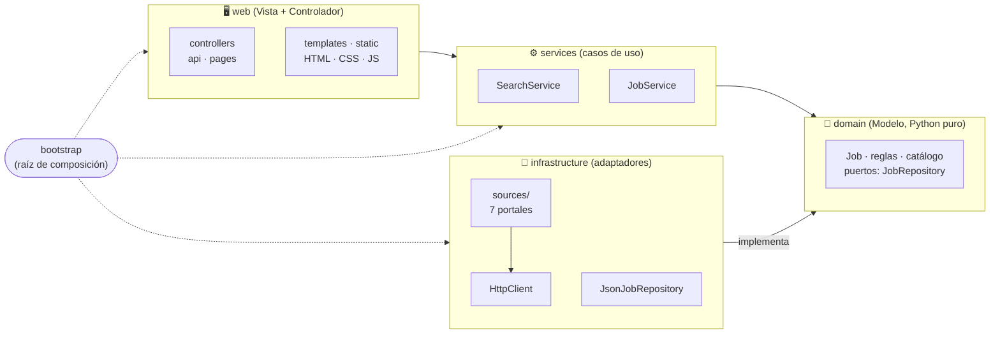

<div align="center">

# 🔎 Buscador de empleos

**Reúne ofertas de 7 portales de empleo en una sola página, con filtros que sí sirven:**
**tecnologías, salario, fecha, modalidad y descripción completa.**


</div>

---

## 📑 Contenido

[Qué hace](#-qué-hace) · [Fuentes](#️-fuentes) · [Inicio rápido](#-inicio-rápido) · [Guía de uso](#️-guía-de-uso-y-filtros) · [Configuración](#️-configuración) · [Arquitectura](#️-arquitectura) · [Estructura](#-estructura) · [API](#-api) · [Calidad](#-calidad) · [Datos y privacidad](#-datos-y-privacidad) · [Problemas frecuentes](#️-problemas-frecuentes) · [Limitaciones](#️-limitaciones) · [Contribuir](#-contribuir)

---

## ✨ Qué hace

Pensado para buscar trabajo como **analista de datos** o **desarrollador de software** en **Bogotá o remoto**:

- 🌐 **Busca en varias páginas a la vez** y unifica los resultados en un mismo formato.
- 🧠 **Entiende cada oferta:** tecnologías (Java, Angular, SQL…), modalidad, salario, contrato y tipo de cargo.
- 🎛️ **Filtra de verdad:** incluir o excluir tecnologías, rango de salario, fecha, fuente y más.
- 📖 **Muestra la descripción dentro de la página**, sin abrir los links uno por uno.
- 🔁 **Acumula historial:** cada búsqueda suma ofertas nuevas sin borrar las anteriores.
- 💱 **Compara salarios en pesos:** convierte otras monedas con tasas configurables.

## 🗂️ Fuentes

| Grupo | Fuente | Se obtiene de | Salario | Descripción |
|---|---|---|:-:|:-:|
| 🇨🇴 Colombia | **Computrabajo** | HTML | ✅ | ✅ |
| 🇨🇴 Colombia | **elempleo** | HTML + JSON embebido | ✅ | ✅ |
| 🇨🇴 Colombia | **Hireline** | HTML + JSON-LD | ✅ | ✅ |
| 💻 Tecnología | **Get on Board** | API pública | ✅ | ✅ |
| 💻 Tecnología | **Torre** | API pública | ✅ | ✅ |
| 🔗 Redes | **LinkedIn** | API pública de empleos (sin iniciar sesión) | ➖ | ✅ |
| 🔗 Agregador | **Indeed** | HTML (huella de Chrome para evitar el 403) | ✅ | ❌ |

> ⚠️ **Torre** cambió su API pública y hoy responde 400: la app lo avisa una vez y la omite. Sus ofertas ya guardadas se siguen mostrando.
>
> Evaluadas y descartadas: Himalayas, RemoteOK y We Work Remotely (en inglés), Magneto (sin API pública), Jooble (Cloudflare), Glassdoor (exige sesión) y Workana (freelance).

## 🚀 Inicio rápido

```bash
git clone <este-repositorio> && cd buscador-empleos
py -m venv .venv
.venv\Scripts\activate            # Linux/macOS: source .venv/bin/activate
pip install -e .                  # instala el proyecto y sus dependencias

buscador-empleos                  # o:  python -m buscador_empleos
```

Abre **http://localhost:5000**, pulsa **Actualizar ofertas** y usa los filtros del panel izquierdo.

> ⏱️ Una búsqueda completa (7 fuentes + cargos relacionados) puede tardar **20 minutos o más**. Para algo rápido, desmarca *Incluir cargos relacionados* o usa 1 página por fuente.

Sin instalar nada (si ya tienes las dependencias): `py run.py`. Opciones: `--host`, `--port`, `--data-file`, `--debug`, `--version`.

## 🎛️ Guía de uso y filtros

### 1. Traer ofertas nuevas (panel «Buscar nuevas ofertas»)

| Control | Qué hace |
|---|---|
| **Cargos** | Los puestos a buscar, separados por comas (por defecto `analista de datos, desarrollador de software`). |
| **Casillas de fuentes** | En qué portales buscar **la próxima vez** que pulses *Actualizar ofertas*. |
| **Incluir cargos relacionados** | Además de tus cargos busca términos parecidos («programador», «ingeniero de datos»…). Trae muchas más ofertas, pero tarda más. |
| **Páginas por fuente** | 1, 2, 3 o 5 páginas de resultados por portal. Más páginas = más ofertas, pero más tiempo y más riesgo de que te limiten (error 429). |

Mientras corre se ve una barra de progreso y el registro de lo que va haciendo cada fuente.

### 2. Filtrar lo que ya está guardado (panel «Filtrar resultados»)

Los filtros se aplican al pulsar **Aplicar filtros** (o Enter); **Limpiar** los restablece.

| Filtro | Descripción |
|---|---|
| **Texto** | Busca en el título y la empresa. |
| **Modalidad** | Remoto, híbrido, presencial o no indicado. |
| **Tipo de cargo** | Analista de datos, desarrollador u otros (se deduce del título). |
| **Búsqueda original** | La búsqueda que encontró la oferta. |
| **Fuentes a mostrar** | Oculta o muestra portales en la lista (no borra ofertas). |
| **Fecha de publicación** | Últimas 24 horas, 3, 7, 15 o 30 días, o 3 meses; con opción de incluir las que no traen fecha (Indeed). |
| **Salario (COP/mes)** | Mínimo y máximo; con opción de incluir las ofertas sin salario publicado. |
| **Tipo de contrato** | Indefinido, fijo, obra o labor, etc. |
| **Lenguajes y tecnologías** | 66 tecnologías en 5 grupos (lenguajes, frameworks, datos y BI, bases de datos, nube y DevOps). |

**Las tecnologías tienen tres estados:**

| Acción | Resultado |
|---|---|
| Un clic | 🔵 **Incluir**: solo ofertas que la mencionan |
| Doble clic | 🔴 **Excluir**: oculta las ofertas que la mencionan (tachada en rojo) |
| Otro clic | ⚪ Quitar el filtro |

El selector **Cualquiera / Todas** decide si basta con una de las tecnologías incluidas o deben estar todas. Las que filtras se resaltan en amarillo dentro de la descripción.

### 3. Leer y ordenar

- **Ver descripción** despliega el texto completo dentro de la tarjeta; **Abrir oferta ↗** va a la página original.
- El orden puede ser por **más recientes** (por defecto), **mayor salario** o **más tecnologías**.
- La lista muestra hasta 300 ofertas; el contador indica cuántas cumplen los filtros.

## ⚙️ Configuración

Variables de entorno (todas opcionales; las opciones de línea de comandos tienen prioridad):

| Variable | Por defecto | Descripción |
|---|---|---|
| `BUSCADOR_HOST` | `127.0.0.1` | Dirección donde escucha |
| `BUSCADOR_PORT` | `5000` | Puerto |
| `BUSCADOR_DATA_FILE` | `data/jobs.json` | Dónde se guardan las ofertas |
| `BUSCADOR_DEFAULT_PAGES` | `2` | Páginas por fuente |
| `BUSCADOR_MAX_PAGES` | `5` | Tope de páginas por fuente |
| `BUSCADOR_HTTP_TIMEOUT` | `25` | Segundos de espera por petición |
| `BUSCADOR_FX` | *(vacío)* | Tasas a pesos, p. ej. `USD=3900,EUR=4300` (las tasas por defecto son **aproximadas**) |

Un valor inválido detiene el arranque con un mensaje claro (código de salida 2).

## 🏛️ Arquitectura

Capas con dependencias en un solo sentido, y MVC en la parte web. Detalle y diagramas en **[docs/architecture.md](docs/architecture.md)**.



| Capa | Carpeta | Responsabilidad |
|---|---|---|
| **Modelo** | `domain/` | La entidad `Job` y las reglas de negocio (salario, fecha, modalidad, tecnologías, cargo). Solo biblioteca estándar. |
| **Casos de uso** | `services/` | Orquestan: buscar en las fuentes y guardar, consultar ofertas. Reciben sus dependencias por constructor. |
| **Infraestructura** | `infrastructure/` | Lo que toca el exterior: red, HTML de terceros, disco. Implementa los puertos del dominio. |
| **Controlador** | `web/controllers/` | Reciben HTTP, validan, llaman a un servicio y responden. Sin reglas de negocio. |
| **Vista** | `web/templates`, `web/static` | HTML, CSS y JavaScript (módulos ES). |

Las reglas de capas **se comprueban automáticamente** en `tests/test_architecture.py`.

## 📁 Estructura

```text
buscador-empleos/
├── pyproject.toml                  # Empaquetado y configuración de ruff, mypy y coverage
├── run.py                          # Atajo para arrancar sin instalar
├── docs/architecture.md            # Diagramas y decisiones de diseño
├── CONTRIBUTING.md · CHANGELOG.md
├── .github/workflows/ci.yml        # Lint, tipos y pruebas en cada cambio
├── data/jobs.json                  # Ofertas guardadas
├── src/buscador_empleos/
│   ├── __main__.py · cli.py        # Línea de comandos
│   ├── settings.py                 # Configuración (variables BUSCADOR_*)
│   ├── bootstrap.py                # Raíz de composición: conecta las piezas
│   ├── domain/                     # 🧱 Modelo
│   │   ├── job.py · catalog.py · repository.py (puerto)
│   │   └── salary.py · dates.py · modality.py · classification.py · text.py
│   ├── services/                   # ⚙️ Casos de uso
│   │   ├── search_service.py · job_service.py
│   ├── infrastructure/             # 🔌 Adaptadores
│   │   ├── http.py · html.py
│   │   ├── persistence/json_repository.py
│   │   └── sources/                #    una fuente por archivo + base.py
│   └── web/                        # 🖥️ Vista y Controlador
│       ├── __init__.py             #    create_app()
│       ├── controllers/            #    api.py · pages.py
│       ├── schemas.py · serializers.py · errors.py · security.py
│       ├── templates/index.html
│       └── static/{css,js}/        #    JS dividido en módulos
└── tests/                          # Refleja la estructura del código (260 pruebas)
```

## 🔌 API

| Método | Ruta | Descripción |
|---|---|---|
| `GET` | `/` | Página principal |
| `GET` | `/api/health` | Estado y versión |
| `GET` | `/api/jobs` | Ofertas guardadas (sin descripción, para que cargue rápido) |
| `GET` | `/api/jobs/<id>/description` | Descripción completa de una oferta |
| `POST` | `/api/search` | Lanza una búsqueda en segundo plano → `202` |
| `GET` | `/api/status` | Progreso y registro de la búsqueda en curso |

`POST /api/search` recibe `{"roles": [...], "sources": [...], "pages": 2, "expand": true}`. Responde `400` si el cuerpo es inválido y `409` si ya hay una búsqueda en curso. Los errores de la API siempre son `{"error": "..."}`.

## ✅ Calidad

```bash
pip install -e ".[dev]"

python -m unittest discover -s tests -t .      # 260 pruebas, sin internet (incluye las de JavaScript si hay Node)
ruff check src tests && ruff format --check src tests
mypy                                           # tipado estricto
coverage run -m unittest discover -s tests -t . && coverage report   # exige ≥ 90 %
node --test tests/js/*.test.mjs                # solo la lógica de JavaScript
```

Hoy: **260 pruebas, 99 % de cobertura (con ramas), `mypy --strict` y `ruff` sin avisos.** Para comprobar que las pruebas protegen de verdad, se introdujeron 16 fallos a propósito en una copia del proyecto y las pruebas detectaron los 16.

Las pruebas reflejan la estructura del código:

| Carpeta | Qué comprueba |
|---|---|
| `tests/domain/` | Reglas de negocio: salarios, fechas, modalidad, clasificación, `Job` y consistencia del catálogo |
| `tests/infrastructure/` | Repositorio JSON (atómico, caché, archivo dañado), clientes HTTP y ayudantes de HTML |
| `tests/infrastructure/sources/` | Cada fuente con HTML o JSON de ejemplo y un cliente HTTP falso |
| `tests/services/` | Búsqueda en segundo plano (progreso, errores, una a la vez) y consulta de ofertas |
| `tests/web/` | Cada ruta de la API, validación, errores, página y cabeceras de seguridad |
| `tests/js/` | Lógica de filtrado y dibujado del navegador, con `node --test` |
| `tests/test_architecture.py` | Que cada capa solo dependa de las que debe |
| `tests/support.py` | `FakeHttpClient`, `make_job` y otros dobles de prueba compartidos |

## 🔒 Datos y privacidad

- Las ofertas se guardan **solo en tu equipo**, en `data/jobs.json` (o donde indique `BUSCADOR_DATA_FILE`). Nada se envía a terceros: la app únicamente consulta los portales de empleo.
- **No usa cuentas ni contraseñas.** LinkedIn se consulta por su API pública, sin iniciar sesión, para no poner en riesgo tu cuenta.
- `data/jobs.json` hoy está versionado en git. Si no quieres subir tus búsquedas a un repositorio, agrega `data/` a `.gitignore`.

## 🛠️ Problemas frecuentes

| Síntoma | Causa y solución |
|---|---|
| La lista está vacía | Aún no hay ofertas guardadas: pulsa **Actualizar ofertas**. |
| Un enlace de Computrabajo da **403 Forbidden** en tu navegador | Bloqueo temporal de Computrabajo, a veces por muchas consultas seguidas. Prueba en una ventana de incógnito o en otro navegador, apaga la VPN y espera unos minutos. |
| El registro dice **429** (LinkedIn u otra fuente) | Te limitaron por demasiadas consultas. Espera unos minutos y usa menos páginas o desmarca *cargos relacionados*. |
| **Torre** no devuelve nada | Su API pública cambió y responde 400. La app lo avisa una vez y sigue con las demás fuentes. |
| **Indeed** devuelve 0 o falla | Cloudflare puede bloquear la petición; se reintenta en la siguiente búsqueda. Indeed nunca trae descripción. |
| `Python was not found` en Windows | Usa el lanzador `py` (por ejemplo `py -m venv .venv`) o instala Python desde python.org. |
| `Address already in use` | El puerto 5000 está ocupado: `buscador-empleos --port 8000`. No arranques dos servidores en el mismo puerto: las respuestas se mezclan. |
| `No se pudo leer .../jobs.json` | El archivo está dañado. La app no lo repara sola: restaura una copia (`git checkout data/jobs.json`) o bórralo para empezar de cero. |
| El arranque termina con un error de configuración (código 2) | Una variable `BUSCADOR_*` tiene un valor inválido; el mensaje indica cuál. |

## ⚠️ Limitaciones

- **Son páginas externas:** si una cambia su diseño o su API, esa fuente deja de funcionar hasta ajustarla (como pasó con Torre).
- **Indeed** no entrega la descripción (su detalle responde 401) ni la fecha; las tecnologías salen solo del título.
- **Fechas aproximadas:** LinkedIn y elempleo dicen «Hace 1 mes» sin más precisión.
- **Salarios:** muchas ofertas dicen «a convenir»; las de otras monedas usan tasas aproximadas.
- **Límites de las fuentes:** muchas búsquedas seguidas pueden provocar `429`; espera unos minutos.
- **Servidor de desarrollo:** `buscador-empleos` usa el servidor de Flask, pensado para uso personal en tu equipo. Para exponerlo, sírvelo con un servidor WSGI (`waitress-serve --call buscador_empleos.web:create_app`).
- **Uso responsable:** respeta los términos de cada portal y no lances búsquedas masivas.

## 🤝 Contribuir

Mira [CONTRIBUTING.md](CONTRIBUTING.md): cómo preparar el entorno, las comprobaciones que deben pasar y cómo agregar una fuente nueva.
