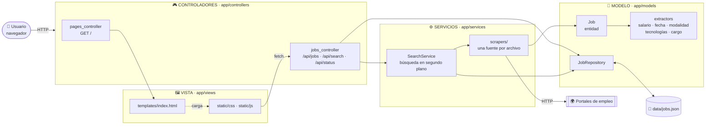
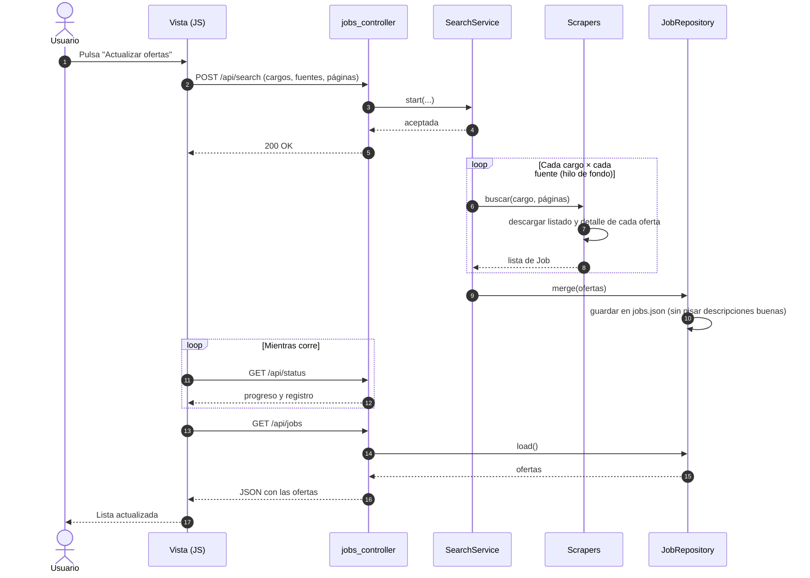
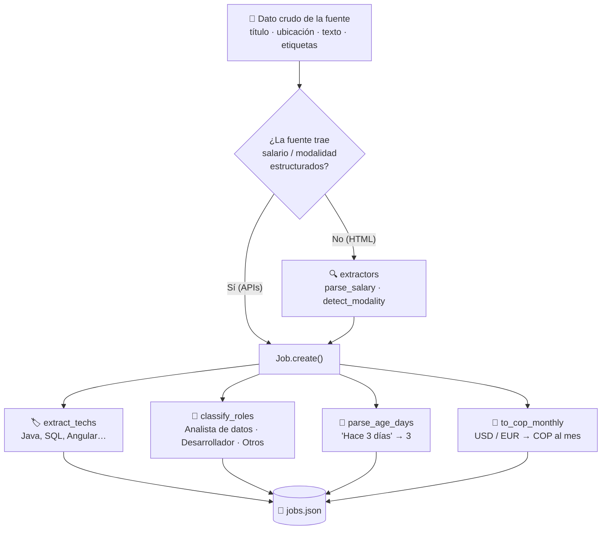

<div align="center">

# 🔎 Buscador de empleos

**Reúne ofertas de 7 portales de empleo en una sola página, con filtros que sí sirven:**
**tecnologías, salario, fecha, modalidad y descripción completa.**


</div>

---

## 📑 Contenido

- [¿Qué hace?](#-qué-hace)
- [Fuentes de empleo](#-fuentes-de-empleo)
- [Instalación y uso](#-instalación-y-uso)
- [Filtros disponibles](#-filtros-disponibles)
- [Arquitectura (MVC)](#-arquitectura-mvc)
- [Cómo funciona una búsqueda](#-cómo-funciona-una-búsqueda)
- [Estructura del proyecto](#-estructura-del-proyecto)
- [API](#-api)
- [Configuración](#-configuración)
- [Agregar una fuente nueva](#-agregar-una-fuente-nueva)
- [Pruebas](#-pruebas)
- [Limitaciones conocidas](#-limitaciones-conocidas)

---

## ✨ ¿Qué hace?

Pensado para buscar trabajo como **analista de datos** o **desarrollador de software** en **Bogotá o remoto**:

- 🌐 **Busca en varias páginas a la vez** y unifica los resultados en un mismo formato.
- 🧠 **Entiende cada oferta:** detecta tecnologías (Java, Angular, SQL…), modalidad (remoto, híbrido, presencial), salario, tipo de contrato y tipo de cargo.
- 🎛️ **Filtra de verdad:** incluye o excluye tecnologías, rango de salario, fecha de publicación y más.
- 📖 **Muestra la descripción dentro de la página**, sin abrir los links uno por uno.
- 🔁 **Acumula historial:** cada búsqueda suma ofertas nuevas sin borrar las anteriores.
- 💱 **Compara salarios en pesos:** convierte monedas extranjeras con tasas configurables.

---

## 🗂️ Fuentes de empleo

| Grupo | Fuente | Cómo se obtiene | Salario | Descripción |
|---|---|---|:-:|:-:|
| 🇨🇴 Colombia | **Computrabajo** | HTML | ✅ | ✅ |
| 🇨🇴 Colombia | **elempleo** | HTML | ✅ | ✅ |
| 🇨🇴 Colombia | **Hireline** | HTML + datos estructurados | ✅ | ✅ |
| 💻 Tecnología | **Get on Board** | API pública | ✅ | ✅ |
| 💻 Tecnología | **Torre** | API pública | ✅ | ✅ |
| 🔗 Redes | **LinkedIn** | API pública de empleos (sin iniciar sesión) | ➖ | ✅ |
| 🔗 Agregador | **Indeed** | HTML (con huella de Chrome para evitar el 403) | ✅ | ❌ |

> ⚠️ **Torre** cambió su API pública y hoy responde 400: la app lo avisa y la omite. Sus ofertas ya guardadas se siguen mostrando.

<details>
<summary><b>Páginas que se evaluaron y no se incluyeron</b></summary>

| Página | Motivo |
|---|---|
| Himalayas, RemoteOK, We Work Remotely | Ofertas en inglés |
| Magneto | Su búsqueda no responde sin iniciar sesión |
| Jooble | Bloqueado por Cloudflare (403) |
| Glassdoor | Exige iniciar sesión |
| Workana | Proyectos freelance, no empleos |

</details>

---

## 🚀 Instalación y uso

**Requisitos:** Python 3 (probado con 3.14).

```bash
# 1. Instalar dependencias
py -m pip install -r requirements.txt

# 2. Arrancar el servidor
py run.py
```

Abre **http://localhost:5000** en el navegador.

**Primer uso:**

1. Pulsa **Actualizar ofertas** (arriba a la derecha) para descargar ofertas nuevas.
2. Espera a que termine la barra de progreso. La búsqueda corre en segundo plano.
3. Usa los filtros del panel izquierdo y pulsa **Aplicar filtros**.

> ⏱️ Una búsqueda completa (7 fuentes + cargos relacionados) puede tardar **20 minutos o más**. Para algo rápido, desmarca *Incluir cargos relacionados* o usa 1 página por fuente.

---

## 🎛️ Filtros disponibles

| Filtro | Descripción |
|---|---|
| **Texto** | Busca en el título y la empresa |
| **Modalidad** | Remoto, híbrido, presencial o no indicado |
| **Tipo de cargo** | Analista de datos, desarrollador u otros (se deduce del título) |
| **Fecha de publicación** | 24 horas, 3, 7, 15 o 30 días, 3 meses |
| **Salario** | Mínimo y máximo en COP al mes, con opción de incluir ofertas sin salario |
| **Tipo de contrato** | Indefinido, fijo, obra o labor, etc. |
| **Tecnologías** | Más de 60, agrupadas (lenguajes, frameworks, datos y BI, bases de datos, nube) |
| **Fuentes a mostrar** | Marca u oculta cada portal |

**Tecnologías con tres estados:**

| Acción | Resultado |
|---|---|
| Un clic | 🔵 **Incluir**: solo ofertas que la mencionan |
| Doble clic | 🔴 **Excluir**: oculta las ofertas que la mencionan |
| Otro clic | ⚪ Quitar el filtro |

Con el selector **Cualquiera / Todas** decides si basta con una de las tecnologías marcadas o deben estar todas.

**Búsqueda ampliada:** con *Incluir cargos relacionados* la app también busca términos parecidos (por ejemplo "programador", "ingeniero de datos") y con *Páginas por fuente* decides cuántas páginas leer de cada portal.

---

## 🏛️ Arquitectura (MVC)



| Capa | Carpeta | Responsabilidad |
|---|---|---|
| **Modelo** | `app/models` | La entidad `Job`, las reglas de negocio que extraen datos del texto (`extractors`), los catálogos (tecnologías, cargos) y la persistencia (`JobRepository`). No conoce Flask. |
| **Vista** | `app/views` | HTML, CSS y JavaScript. Pinta la lista y aplica los filtros en el navegador. |
| **Controlador** | `app/controllers` | Recibe la petición HTTP, llama al modelo o al servicio y devuelve la respuesta. Sin lógica de negocio. |
| **Servicios** | `app/services` | Lo que el modelo necesita del exterior: los *scrapers* de cada portal y la búsqueda en segundo plano. |

---

## 🔄 Cómo funciona una búsqueda



### De texto crudo a oferta estructurada



---

## 📁 Estructura del proyecto

```text
buscador-empleos/
├── run.py                          # Punto de entrada
├── requirements.txt
├── data/
│   └── jobs.json                   # Ofertas guardadas
├── tests/
│   └── test_models.py
└── app/
    ├── __init__.py                 # Fábrica de la aplicación Flask
    ├── config.py                   # Puerto, páginas, tasas de cambio
    │
    ├── models/                     # 🧱 MODELO
    │   ├── job.py                  #    Entidad Job
    │   ├── extractors.py           #    Reglas: salario, modalidad, fecha, tecnologías, cargo
    │   ├── catalog.py              #    Listas de tecnologías y cargos
    │   └── job_repository.py       #    Lectura y escritura de jobs.json (con caché)
    │
    ├── views/                      # 🖼️ VISTA
    │   ├── templates/index.html
    │   └── static/
    │       ├── css/styles.css
    │       └── js/app.js
    │
    ├── controllers/                # 🎮 CONTROLADORES
    │   ├── pages_controller.py     #    GET /
    │   └── jobs_controller.py      #    API REST
    │
    ├── services/                   # ⚙️ SERVICIOS
    │   ├── search_service.py       #    Búsqueda en segundo plano
    │   └── scrapers/               #    Una fuente por archivo
    │       ├── __init__.py         #    Registro de fuentes
    │       ├── base.py             #    Cliente HTTP común
    │       ├── computrabajo.py
    │       ├── elempleo.py
    │       ├── hireline.py
    │       ├── getonboard.py
    │       ├── torre.py
    │       ├── linkedin.py
    │       └── indeed.py
    │
    └── utils/
        └── text.py                 # Limpieza de texto, HTML → texto, fechas relativas
```

---

## 🔌 API

| Método | Ruta | Descripción |
|---|---|---|
| `GET` | `/` | Página principal |
| `GET` | `/api/jobs` | Todas las ofertas guardadas (sin descripción, para que cargue rápido) |
| `GET` | `/api/jobs/<id>/description` | Descripción completa de una oferta |
| `POST` | `/api/search` | Lanza una búsqueda en segundo plano |
| `GET` | `/api/status` | Progreso y registro de la búsqueda en curso |

**Cuerpo de `POST /api/search`:**

```json
{
  "roles": ["analista de datos", "desarrollador de software"],
  "sources": ["Computrabajo", "elempleo", "Get on Board"],
  "pages": 2,
  "expand": true
}
```

Responde `409` si ya hay una búsqueda en curso.

---

## ⚙️ Configuración

Todo está en [`app/config.py`](app/config.py):

| Variable | Valor | Para qué sirve |
|---|---|---|
| `PORT` | `5000` | Puerto del servidor |
| `DEFAULT_PAGES` | `2` | Páginas por fuente si no se indica otra cosa |
| `MAX_PAGES` | `5` | Tope de páginas por fuente |
| `FX_TO_COP` | USD 4000, EUR 4400… | Tasas **aproximadas** para pasar salarios a pesos. Ajústalas si necesitas más precisión |

Para sumar tecnologías o tipos de cargo, edita [`app/models/catalog.py`](app/models/catalog.py) y **sube `CATALOG_VERSION`**: las ofertas guardadas se reclasifican una sola vez al arrancar.

---

## ➕ Agregar una fuente nueva

1. Crea `app/services/scrapers/<fuente>.py` con una función que reciba `(query, pages, log)` y devuelva una lista de `Job`:

   ```python
   from app.models.job import Job

   def mifuente(query, pages=2, log=print):
       jobs = []
       # ... descargar y recorrer los resultados ...
       jobs.append(Job.create("MiFuente", id_oferta, titulo, empresa, ubicacion,
                              url, "Hace 2 días", descripcion, tags=[contrato]))
       return jobs
   ```

   Si la fuente ya trae el salario o la modalidad, pásalos con `salary=(texto, minimo_en_cop)` y `modality="Remoto"`.

2. Regístrala en `app/services/scrapers/__init__.py`:

   ```python
   SOURCES = {..., "MiFuente": mifuente}
   ```

3. Reinicia el servidor: aparece sola en las casillas de búsqueda y en el filtro de fuentes.

---

## ✅ Pruebas

```bash
py -m unittest discover -s tests -t .
```

Cubren las reglas del modelo (salarios, fechas, cargos, tecnologías, modalidad), la conversión de monedas, la ampliación de búsquedas y que una búsqueda con error no pise una descripción ya guardada. No usan internet.

---

## ⚠️ Limitaciones conocidas

- **Son páginas externas:** si una cambia su diseño o su API, esa fuente deja de funcionar hasta ajustar su *scraper* (como pasó con Torre).
- **Indeed** no entrega la descripción (su página de detalle responde 401) y tampoco la fecha de publicación; las tecnologías se detectan solo por el título.
- **Fechas aproximadas:** LinkedIn y elempleo dicen "Hace 1 mes" sin más precisión.
- **Salarios:** muchas ofertas dicen "a convenir". Los publicados en otras monedas usan tasas aproximadas.
- **Límites de las fuentes:** si buscas muchas veces seguidas, LinkedIn y otras pueden responder `429` (demasiadas consultas). Espera unos minutos.
- **Uso personal:** respeta los términos de cada portal y no lances búsquedas masivas.
