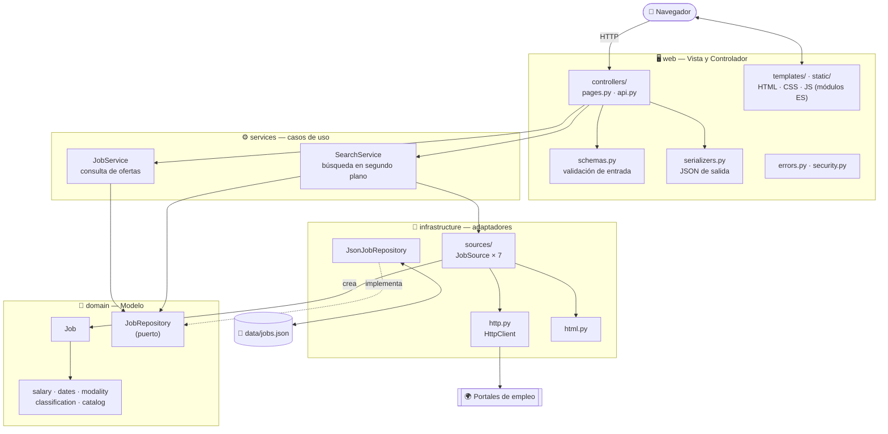
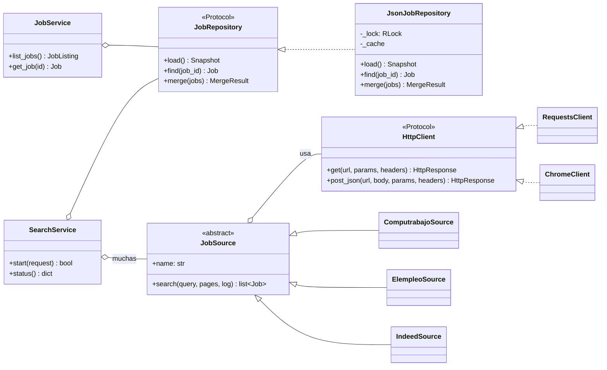
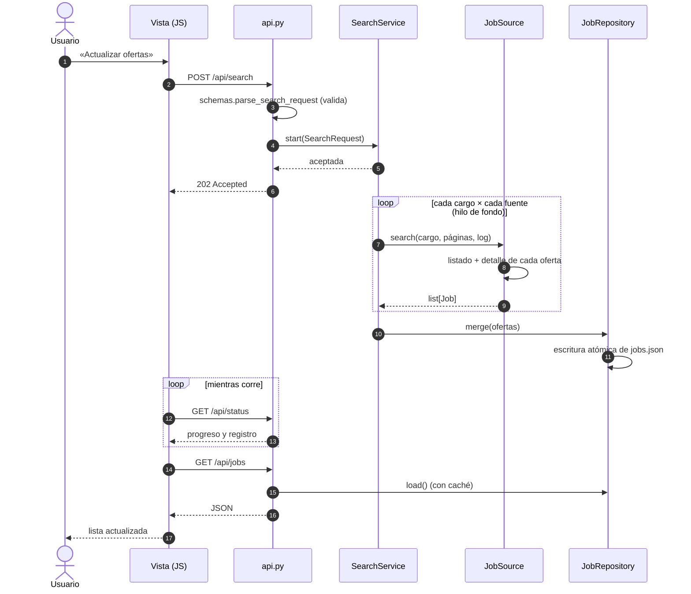

# Arquitectura

La aplicación está organizada en **cuatro capas** con dependencias en un solo sentido. La parte web sigue **MVC**.

```text
        web  ──▶  services  ──▶  domain  ◀──  infrastructure
```

| Capa | Rol en MVC | Puede importar | No puede importar |
|---|---|---|---|
| `domain` | **Modelo** | solo la biblioteca estándar | Flask, `requests`, `bs4`, las demás capas |
| `services` | casos de uso (Modelo) | `domain`, la interfaz de las fuentes | Flask, `requests`, `bs4` |
| `infrastructure` | adaptadores (Modelo) | `domain` | `services`, `web`, Flask |
| `web` | **Vista + Controlador** | `domain`, `services`, `settings`, `bootstrap` | `infrastructure` directamente |

La raíz de composición (`bootstrap.py`) es el único lugar que conoce las piezas concretas y las conecta.
`tests/test_architecture.py` analiza los `import` de cada archivo y falla si alguna capa rompe estas reglas.

## Vista general



## Puertos y adaptadores

El dominio y los servicios dependen de **interfaces**; la infraestructura las implementa. Eso permite probar sin red ni disco y cambiar una pieza sin tocar el resto.



## Una búsqueda de principio a fin



## Decisiones de diseño

| Decisión | Por qué |
|---|---|
| **Diseño `src/`** y paquete con nombre propio (`buscador_empleos`) | Evita importar el código sin instalar y que el paquete se llame genéricamente `app`. |
| **Dominio sin dependencias externas** | Las reglas (salarios, fechas, clasificación) son lo más valioso y lo que más cambia: deben poder probarse al instante y sin red. |
| **Fuentes como clases con `HttpClient` inyectado** | Las pruebas pasan un cliente falso en vez de parchar módulos. Cada fuente es independiente: agregar una no toca ninguna otra. |
| **Raíz de composición única** (`bootstrap.py`) | Un solo lugar conoce las clases concretas; el resto recibe interfaces. |
| **Configuración por entorno, validada y de solo lectura** (`Settings`) | Un valor inválido detiene el arranque con un mensaje claro, no falla más tarde. |
| **Escritura atómica del JSON** (archivo temporal + reemplazo) | Un corte a mitad de escritura no deja el archivo dañado. |
| **Caché del repositorio invalidada por cambio del archivo** | Reconstruir cada oferta recalcula tecnologías; sin caché cada petición tardaba ~2 s. |
| **Versión del catálogo guardada junto a los datos** | Si cambia la lista de tecnologías, las ofertas guardadas se reclasifican una sola vez. |
| **Validación en el borde** (`schemas.py`) y errores JSON coherentes | El servicio recibe objetos ya válidos; el cliente siempre recibe `{"error": ...}` en la API. |
| **`POST /api/search` responde 202** | La búsqueda es asíncrona: «aceptada», no «terminada». |
| **CSP estricta, sin scripts ni estilos en línea** | La página solo carga recursos propios; se puede prohibir todo lo demás. |
| **Los datos de la página se entregan como JSON, no se duplican en JS** | Los grupos de tecnologías viven una sola vez, en el dominio. |
| **JavaScript en módulos ES; la lógica pura separada del DOM** | `filters.js` se prueba con `node --test` sin navegador. |
| **Pruebas de arquitectura** | Las reglas de capas dejan de ser una convención y pasan a ser una comprobación automática. |

## Cómo extender

- **Una fuente nueva:** ver [CONTRIBUTING.md](../CONTRIBUTING.md#agregar-una-fuente).
- **Otro almacenamiento** (SQLite, etc.): implementar `JobRepository` y pasarlo a `build_container(repository=...)`. Nada más cambia.
- **Otra tecnología o tipo de cargo:** editar `domain/catalog.py` y **subir `CATALOG_VERSION`**.
